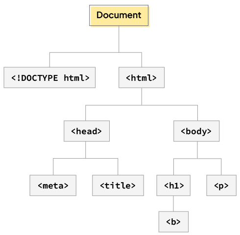
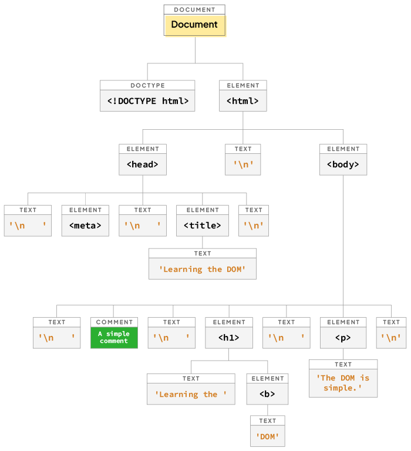
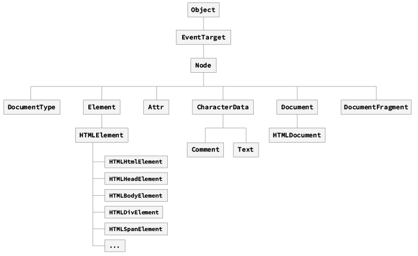

# Manipulació del DOM

# Abans de res.

Browser
https://es.javascript.info/browser-environment

1. Explicar què és el DOM i perquè és important.

El DOM és l'estructura de dades que representa el contingut d'una pàgina web. Aquesta estructura de dades és un arbre d'objectes que representa tots els elements HTML de la pàgina. Aquesta estructura de dades és el que ens permet accedir i modificar els elements HTML de la pàgina des de JavaScript.

## DOM Tree

El DOM és un model basat en objectes que representa el contingut d'un document HTML i, per tant, si el convertim en un arbre ens quedaria quelcom així:



Vegem un exemple més concret:



> **Note:** Els nodes no representen únicament els elements HTML, sinó que també representen els atributs, el text, els comentaris, etc.

Associat a això, tenim unes propietats i mètodes que ens permeten accedir i modificar aquesta estructura de dades. Aquestes estan definides a través de diverses interfícies del DOM API. També hi ha una jerarquia de classes associada:



2. Veure amb l'exemple de la Wikipedia ("manipulating") de quina manera s'accedeix al DOM per entendre que es genera un arbre d'objectes. --> console.dir(document)

   - Moltes propietats i sub-objectes que no ens han d'impressionar. Molts d'ells segurament mai els utilitzem. Els anirem veient!
   - https://dom.spec.whatwg.org/

3. Ex: document.all[10].innerText="SILKIE"

## Elements

Si el **Node** és una interfície abstracte que no pot ser instanciada directament, vol dir que està pensada per a ser heretada per altres interfícies més específiques. Aquestes interfícies són les que representen els diferents tipus de nodes que podem trobar a l'arbre del DOM.

**Element** és un exemple d'aquestes interfícies. Conté les propietats i mètodes que són comuns a tots els elements HTML. Això vol dir que tots els nodes que representen elements HTML hereten d'aquesta interfície. Algunes de les propieteats més omuns d'aquesta interfície són:

| Property               | Purpose (Propòsit)                                                               |
| ---------------------- | -------------------------------------------------------------------------------- |
| children               | Una col·lecció de tots els nodes fills elements de l'element cridant.            |
| firstElementChild      | El primer node fill element de l'element cridant.                                |
| lastElementChild       | El darrer node fill element de l'element cridant.                                |
| nextElementSibling     | El següent node germà de l'element cridant que és un node element en si mateix.  |
| previousElementSibling | El node germà anterior de l'element cridant que és un node element en si mateix. |
| innerHTML              | El contingut HTML dins de l'element cridant.                                     |
| tagName                | The name of the element's tag.                                                   |

I alguns mètodes:

| Property               | Purpose (Propòsit)                                                               |
| ---------------------- | -------------------------------------------------------------------------------- |
| children               | Una col·lecció de tots els nodes fills elements de l'element cridant.            |
| firstElementChild      | El primer node fill element de l'element cridant.                                |
| lastElementChild       | El darrer node fill element de l'element cridant.                                |
| nextElementSibling     | El següent node germà de l'element cridant que és un node element en si mateix.  |
| previousElementSibling | El node germà anterior de l'element cridant que és un node element en si mateix. |
| innerHTML              | El contingut HTML dins de l'element cridant.                                     |
| tagName                | The name of the element's tag.                                                   |
| matches()              | Determinar si l'element cridant coincideix amb un selector CSS donat.            |

## 1. Seleccionant Elements

https://www.codeguage.com/courses/js/html-dom-selecting-elements

Podem aplicar les nostres funcions o accions de manera selectiva. Ho seleccionem fen ús de JS.

1.  **getElementById()**
    - Seleccionem per id de l'element HTML.
    - Ens retorna l'element com a tal!
    - const banner = document.getElementById('banner')
    - const toc = document.getElementById('toc');
      - Podem veure el childNodes. Els podem mostrar amb un console.dir(toc)
    - Seleccionem per etiqueta HTML.
    - Ens retorna un Array-like object amb tots els elements que coincideixen amb la etiqueta.
    - const images = document.getElementsByTagName('img');
      ```javascript
      for (let img of allImages) {
        console.log(img.src)
      }
      ```
    - Compte!!! No és un array! No es poden aplicar els mètodes d'array.
    - divs, ps,
2.  **getElementsByClassName()**
    - Seleccionem per classes HTML.
    - Ens retorna un Array-like object amb tots els elements que coincideixen amb la classe.
    - const squareImages = document.getElementsByClassName('square')
      ```javascript
      for (let img of squareImages) {
        img.src =
          'https://upload.wikimedia.org/wikipedia/commons/thumb/e/e2/Silky_bantam.jpg/440px-Silky_bantam.jpg'
      }
      ```

### QuerySelector

1. **querySelector()**

- Aquest mètode ens permet seleccionar un element HTML utilitzant un selector CSS.
- Una opció més moderna per seleccionar un sol element.
- Amb uns sol mètode podem seleccionar un element, un id, una classe, etc...
- Podem també afegir atributs per seleccionar un element més específic.

Exemples:

- document.querySelector('p')
- document.querySelector('img:nth-of-type(2)')
- document.querySelector('a') --> document.querySelector('a[title="Java"]')

2. **querySelectorAll()**

Mateixa idea, però retorna UNA COL·LECCIÓ de tots els elements que coincideixen (i/o son descendents de l'element on s'aplica, per ex: div.querySelectorAll) amb el selector.

Recorda que el que retorna és un Objecte de JavaScript. No és un array!

- document.querySelectorAll('p')
- document.querySelectorAll('p a')
- document.querySelectorAll('h2 .mw-headline')

## 2. Manipulem Elements - Com canviar el contingut dels elements del DOM

Un cop hem dedicit sobre quin elment volem actuar, podem manipular-lo.

Hi ha MOOOOLTS aspectes qeu podem modificar, podem centrar-nos en els principals.

### innerText

- Aquest mètode ens permet accedir al text d'un element HTML.

Exemple:

```javascript
// Example using innerText
const heading = document.querySelector('h1')
heading.innerText = 'Hello, world!'
```

### innerHTML

- Aquest mètode ens permet accedir a l'estructura i continguts de l'element HTML.

Exemple:

```javascript
const paragraph = document.querySelector('p')
paragraph.innerHTML = '<strong>This text is bold!</strong>'
```

```javascript
h1.innerText = "<i>Hola!<i>" --> No es veurà el text en cursiva, sinó que es veurà el text tal qual, amb les etiquetes HTML.
h1.innerHTML** = "<i>Hola!<i>" --> Sí que es veurà el text en cursiva, perquè estem dient que el text és HTML.
```

### textContent

- Aquest mètode ens permet accedir al text d'un element HTML, però no interpreta les etiquetes HTML. A diferència de innerText, textContent no té en compte el que està passant a la pantalla. Per exemple si hi ha un element que no s'està mostrant per un display: none, no el veurem amb innerText, però si amb textContent!

Exemple:

```javascript
documents.querySelector('p')
paragraph.textContent = 'This is a <strong>paragraph</strong>!'
```

En el cas de les eines de Chrome, no veuràs la diferència entre innerText i textContent. Però si fas servir el mètode getComputedStyle() veuràs que el textContent no té en compte el que està passant a la pantalla. Ex:

```javascript
const paragraph = document.querySelector('p')
const compStyles = getComputedStyle(paragraph)
compStyles.color
compStyles.fontSize
```

I can use += to add to the existing content. For example:

```javascript
const paragraph = document.querySelector('p')
paragraph.innerHTML += '<strong>This text is bold!</strong>'
```

## getAttribute() i setAttribute()

- Podem accedir als atributs directament amb el punt. Ex:

  ```javascript
  const firstLink = document.querySelector('a')
  firstLink.href // "https://en.wikipedia.org/wiki/Java_(programming_language)"
  ```

- firstLink.getAttribute('href')
- firstLink.getAttribute('title')

I també podem modificar els atributs amb el mètode setAttribute(). Ex:

```javascript
firstLink.setAttribute('href', 'https://www.google.com')
```

- **Styles** Això ens permet modificar l'estil dels elements HTML:

  - A JS tots els estils passen a ser **camelCase**. Ex: font-size --> fontSize
    - h1.style.fontSize ='3em'
    - h1.style.color = 'blue'
    - h1.style.border = '2px solid pink'
      ...
  - **IMPORTANT**: L'objecte de JS no conté els estils que s'han definit a CSS, únicament pot accedir als estils aplicats en línia.

  - Normalment el que fem és afegir una classe a l'element HTML i definir els estils a CSS. Així, el JS només ha de fer servir la classe (HO VEUREM)

  - Exemple de allLinks (link.style.color, text, etc...)

  - Si volem veure els estils aplicats a través de CSS, podem fer servir el mètode getComputedStyle()

    - const h1 = document.querySelector('h1')
    - const compStyles = getComputedStyle(h1)
    - compStyles.color
    - compStyles.fontSize

    - Això únicament ens permet veure els estils que s'han definit a l'element HTML.

## ClassList

- Podem afegir, eliminar, modificar, toogle classes d'un element HTML.
- Exemple: Seleccionem tots els enllaços de la pàgina i els canviem el color i la decoració del text.

```javascript
const allLinks = document.querySelectorAll('a')
for (let link of allLinks) {
  link.innerText = 'I AM A LINK!!!!'
  link.style.color = 'rgb(0, 108, 134)'
  link.style.textDecorationColor = 'magenta'
  link.style.textDecorationStyle = 'wavy'
}
```

### .add

- Podem fer servir el mètode classList.add() per afegir una classe a un element HTML sense perdre les classes que ja hi ha definides. Ex:

```javascript
h2.classList.add('purple')
```

### .remove

- Podem eliminar una classe amb el mètode classList.remove(). Ex:

```javascript
h2.classList.remove('border')
```

### .toggle

- Podem fer servir el mètode classList.toggle() per afegir o eliminar una classe. Ex:

```javascript
h2.classList.toggle('border')
```

### Compte!

Creem dues classes a CSS: .purple i .border

- h2.setAttribute("class", "border");
- h2.setAttribute("class", "purple");
- **PROBLEMA!** Només es quedarà amb la classe que s'ha definit en segon lloc. Per tant, només es quedarà amb la classe purple.
- Podem fer servir el mètode classList.add() per afegir una classe a un element HTML sense perdre les classes que ja hi ha definides.
  - h2.classList.add("purple");
- Podem eliminar una classe amb el mètode classList.remove()
  - h2.classList.remove("border");
- Podem fer servir el mètode classList.toggle() per afegir o eliminar una classe.
  - h2.classList.toggle("border");

## Parent, Children, Siblings

- Podem accedir als elements HTML que són parents, children o siblings d'un element HTML.
- De la mateixa manera també ho podem fer amb els nodes.
- Per exemple, _html_ és el parent node de _body_, mentre que body és el node child de _html_. De manera similar, _head_ i _body_ són siblings.
- Exemple de allLinks (link.parentElement, link.children, link.previousElementSibling, link.nextElementSibling)

### Children

**children** és una propietat de la interfície **Element** que ens retorna una col·lecció de tots els nodes fills elements de l'element cridant. No s'ha de confondre amb **childNodes**, que ens retorna tots els nodes fills de l'element cridant, incloent els nodes de text i els nodes de comentari.

```html
<div id="main">
  <p>A paragraph</p>
  <!--A comment-->
</div>
```

```javascript
var mainElement = document.getElementById('main')
console.log('childNodes', mainElement.childNodes.length)
console.log('children', mainElement.children.length)
```

Si proves això la consola retornarà

```javascript
childNodes 5
children 1
```

Prova amb el següent codi HTML:

```html
<html>
  <head>
    <title>HTML DOM</title>
  </head>
  <body>
    <p>Experimenting with the DOM.</p>
  </body>
</html>
```

I el següent codi JavaScript:

```javascript
var children = document.documentElement.childNodes

console.log(children.length) // 5
console.log()

for (var i = 0, len = children.length; i < len; i++) {
  console.log(children[i].nodeName)
}
```

### Parent

- Ex:

```javascript
const firstBold = document.querySelector('b')
firstBold.parentElement
const paragraph = firstBold.parentElement
paragraph.children[0].innerText = 'I am the child!'
```

- Ex de Siblings:

```javascript
const squareImg = document.querySelector('.square')
squareImg.nextElementSibling
squareImg.previousElementSibling
```

- **COMPTE!** nextSibiling != nextElementSibling (el primer és un node, el segon és un element HTML)

## Creant i eliminant nodes

Un dels conceptes més potents que ofereix l'API del DOM és la capacitat de crear nodes de forma programàtica. En aquesta secció, cobrirem com crear alguns dels nodes més comuns en el DOM.

La interfície Document defineix un parell de mètodes de fàbrica (és a dir, mètodes que retornen objectes) per crear tipus de nodes específics.

Aquí teniu una llista dels més útils:

| Mètode                   | Propòsit                                                           |
| ------------------------ | ------------------------------------------------------------------ |
| createElement()          | Crea un nou element HTML amb el nom de l'etiqueta especificada.    |
| createTextNode()         | Crea un nou node de text amb el contingut especificat.             |
| createDocumentFragment() | Crea un nou fragment de document que pot contenir múltiples nodes. |

### createElement()

La sintaxi per crear un nou element HTML és la següent:

```javascript
document.createElement(tagName)
```

Quan creem un nou node, aquest no es mostra a la pàgina fins que no l'afegim a l'arbre del DOM. Això es pot fer amb el mètode appendChild().

```javascript
const newImg = document.createElement('img')
newImg.src =
  'https://images.ecestaticos.com/F-TN2CAB0c5Fldhz_ohhij7Mx08=/0x0:2000x1500/1200x1200/filters:fill(white):format(jpg)/f.elconfidencial.com%2Foriginal%2F66c%2F610%2F55c%2F66c61055c27f77bdbdefa3be537336cd.jpg'
// Afegim un element com a fill d'un altre element
document.body.appendChild(newImg)
```

## Insertant nodes

| Mètode         | Propòsit                                                                 |
| -------------- | ------------------------------------------------------------------------ |
| appendChild()  | Afegeix un node com a últim fill de l'element cridant.                   |
| insertBefore() | Afegeix un node dins de l'element cridant abans d'un node de referència. |
| replaceChild() | Reemplaça un node fill específic de l'element cridant per un altre node. |
| removeChild()  | Elimina un node fill específic de l'element cridant.                     |
| cloneNode()    | Fa una còpia de l'element cridant.                                       |

### appendChild

- El mètode _appendChild()_ de la interfíce **Node** afegeix un node com a fill d'un altre node. La sintaxi:

```javascript
node.appendChild(childNode)
```

_node_ és el node pare al qual volem afegir un fill, i _childNode_ és el node que volem afegir.

Considerem el següent codi:

```html
<body id="body">
  <h1>Learning the DOM</h1>
</body>
```

```javascript
var paraElement = document.createElement('p')
paraElement.innerHTML = 'Learning <code>appendChild()</code>'

var bodyElement = document.getElementById('body')
bodyElement.appendChild(paraElement)
```

### insertBefore

- Aquest afegeix un node dins de l'element cridant abans d'un node de referència. La sintaxi:

```javascript
node.insertBefore(newNode, referenceNode)
```

_node_ és el node pare al qual volem afegir un fill, _newNode_ és el node que volem afegir, i _referenceNode_ és el node de referència.

Considerem el següent codi:

```html
<body id="body">
  <h1>Learning the DOM</h1>
</body>
```

```javascript
var paraElement = document.createElement('p')
paraElement.innerHTML = 'Learning <code>insertBefore()</code>'
var h1Element = document.querySelector('h1')

var bodyElement = document.getElementById('body')
bodyElement.insertBefore(paraElement, h1Element)
```

### append

És un mètode més modern que _appendChild()_ i ens permet acceptar múltiples arguments i tipus de dades. Això vol dir que podem afegir un element, un text, un objecte, etc... Si passem un **string**, aquest es convertirà en un node de text.

```javascript
let div = document.createElement('div')
div.append('Hello', ' ', 'World') // Appends three text nodes to the div
```

### prepend

- Afegeix un element al principi.

```javascript
document.body.prepend(newImg)
```

- Alguna manera més --> insertAdjacentElement https://developer.mozilla.org/es/docs/Web/API/Element/insertAdjacentHTML

## Removing Nodes:

## removeChild()

- Eliminem un element fill d'un altre element.

Donat el següent codi HTML:

```html
<div id="main">
  <h1>A heading</h1>
  <p>A paragraph</p>
</div>
```

El següent codi JavaScript elimina el paràgraf de l'element _main_:

```javascript
var mainElement = document.getElementById('main')
var paraElement = mainElement.getElementsByTagName('p')[0]
mainElement.removeChild(paraElement)
```

## remove()

- Eliminem l'element directament des d'on es crida.

```javascript
const removeMe = document.querySelector('.special')
removeMe.remove()
```

Hi ha més opcions per reemplaçar nodes, clonar-los, etc... Podeu fer un cop d'ull a la documentació de MDN i al següent enllaç:

https://www.codeguage.com/courses/js/html-dom-nodes
